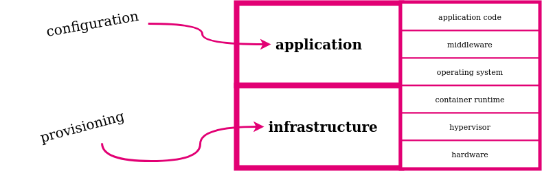

:orphan:

===============================
Cloud Provisioning with Ansible
===============================

.. revealjs-slide::

Is that even possible?

**Nils Magnus**

Senior Cloud Architect Open Telekom Cloud

stackconf 2022, Berlin, Germany

July 19-20, 2022

	   

Nils Magnus
===========

.. list-table::
   :widths: 30 70
   :header-rows: 0

   * - .. figure:: ./nils-magnus.png

     - * Ecosystem Squad of Open Telekom Cloud
       * Tools for our users and Community work
       * 20 years experience in security, operations, cloud
       * tech writer, editor, and journalist
       * Director for German Unix User Group

*Automation should make work easier, not take it away. --- Fred Ammon*

Disclaimer: I'm an Ansible user, not an expert. Plase correct me, if necessary.

Agenda
------

* What is Provisioning?
* 20 quick, but important Cloud and Automation Terms
* Success Story of Ansible
* Architecture Overview
* Installation and technical Prerequisites
* Examples and Demo
* Ansible Collections for Developers
  

Provisioning
============

modern software setups come in (at least two) layers:

* **provisioning** means to build and configure **infrastructure**
* **configuring** means to build and adapt **applications**

Why automate building infrastructure?
-------------------------------------

disaster recovery:
  fast and automated rebuild of setups, short downtime
updating and code hygiene:
  fighting configuration drift: instead of patching, better rebuild
infrastructure testing, compliance of APIs and interfaces:
  setup consists of many components whose interaction is complex
knowledge sharing:
  passing on codified best practices

Forms of Provisioning
---------------------

check these methods of provisioning:

* manually
* run-books stored in wikis or on paper
* bash scripts
* installer (how do they actually work internally?)
* **domain specific languages ​​that support provisioning**

how applicable are *manual error prevention*, *desired state specification*, or *reproducibility* to those methods?

Infrastructure as Code
----------------------

should be

* **declarative** (*what* instead of *how*)
* **convergent** (to approach the target)
* **idempotent** (repetition doesn't hurt), and
* assess and manage **status**

Typical Representatives
-----------------------

IaC comes in many disguises:

* VSphere (haha)
* **Terraform**
* Pulumi
* Heat (or its proprietary cousins like Cloud Formation, ...)

But does Ansible also belong to this list?

Important Terms and Prerequisites
=================================

Ansible:
  configuration management framework, that leverages SSH and
  Python to configure a target from a controller.

controller a. k. a. controller node:
  The system you sit in front of. Has typically checked out a Git
  repo.

targets a. k. a managed nodes:
  The systems you manage as an administrator, devops, or system
  engineer.

  
Ansible Terms and Concepts
--------------------------

module:
  takes care that a resource has a specific state, for example make
  sure that user "magnus" exists or RPM package "emacs" is installed.

task:
  description of the circumstances a module operates on.

role:
  a template on how to combine several tasks into a more holistic
  activity like installing a webserver (installing the package,
  configuring some files, starting the service) play collection.

  
Cloud Terms and Concepts
------------------------
  
cloud:
  service that enables you to manage various resources such as
  servers, storage, and networks via an API.

OpenStack:
  Open Source cloud framework, developed under the four Opens: Open
  Source, Open Design, Open Development, Open Community.

Open Telekom Cloud:
  <commercial break>Public cloud operated for Deutsche Telekom by
  T-Systems International GmbH in Europe by Europeans, based on
  OpenStack. Complies to several certifications and is GDPR compliant,
  which is debatable for other Hyperscaler clouds. </commercial break>

  
Cloud Access Terms and Conepts
------------------------------
 
SDK:
  a Python library that accesses the OpenStack API and performs some
  housekeeping tasks.

Client:
  a CLI tool to query and manipulate cloud resources on the command
  line via the SDK and API. Used for manual tasks.

bastion:
  a multipurpose server in a cloud domain, exposed to the
  Internet. Can (after proper authorization) access servers and other
  ressoures hidden from public users views. This is our today's
  project goal to install.

  
Python Terms and Concepts
-------------------------
  
Python:
  Programming language Ansible and OpenStack SDK are mostly written
  in. We only cover Python 3 here, sometimes at least version 3.8 is
  required.

pip:
  Python Package manager. We install Ansible, the SDK and Client with
  it.

virtual environment:
  sandbox that makes sure that installed Python packages don't mess
  with your Linux distribution.

OpenStack Terms and Concepts
----------------------------
  
ECS:
  Elastic cloud server or just a VM.

image:
  virtual installation medium containing a linux distribution like
  Ubuntu 22.04 or CentOS Stream.

OpenStack Terms and Concepts (II)
---------------------------------
  
flavor:
  abstraction for the combination of CPUs and memory applied to
  a VM. The flavor "s3.medium.1" describes a server with one core and
  1 GByte RAM, for example.

volumes:
  hard drives or block devices in cloud speech.

network:
  IP addresses, networks, subnets, routers, security groups, and some
  more resources work similar like their physical conterparts, but can
  be configured via API and SDK.

  
Ansible Architecture for Classic and Cloud Setups
=================================================

.. list-table::
   :widths: 70 30  
   :align: left
	
   * - well known as a configuration management tool to:

       * create users, groups, ...
       * install packages
       * edit configuration files
       * start services

     - is (or should be):

       * declarative
       * convergent
       * idempotent
       * .

But what changes if it is used as a provisioning tool?

Classic Ansible Operation Architecture
--------------------------------------

.. list-table::
   :widths: 50 50
   :header-rows: 0

   * - * controller has playbook (from a Git repo) and runs it (optimally through a CI/CD server).
       * Ansible connects (almost always with SSH) to the target.
       * there it builds an ad-hoc runtime in Python, executes everything and deletes the tools again.
       * reports the success of its work back to the controller
     - .. figure:: ./arch-cfgmgmt.png

Key Terms of Ansible in Two Minutes
-----------------------------------

.. list-table::
   :widths: 50 50
   :header-rows: 0

   * - * **playbooks** (in YAML)
       * **tasks** describe the desired state
       * **modules** for everything: users, packages, config entries in files, etc.
       * modules are grouped, structured and reused: **plays** and **roles**
       * the top-level entities are in a static or dynamic **inventory**
       * multiple (and sometimes confusing) options for parameterization
     - .. code-block:: yaml

         ---
         - name: Update web servers
           hosts: webservers
           remote_user: root
         
           tasks:
           - name: Ensure Apache is at the latest version
             ansible.builtin.yum:
               name: httpd
               state: latest
           - name: Write the Apache config file
             ansible.builtin.template:
               src: /srv/httpd.j2
               dest: /etc/httpd.conf

One Major Difference for Provisioning
-------------------------------------

.. list-table::
   :widths: 30 70
   :header-rows: 0

   * - * Initially there are no targets to address
       * Cloud-API is accessed via SDK installed on controller
     - .. figure:: ./arch-cloud.png
          :width: 80%

Marry OpenStack with Ansible
----------------------------

Ansible modules manage OpenStack and Open Telekom Cloud ressources

modules do not access the APIs directly

OpenStack SDK acts as a proxy between Ansible and cloud

modules are packaged as Ansible collections

collections are installed with ``ansible-galaxy``

My team develops and maintains the modules ``openstack.cloud`` and ``opentelekomcloud.cloud``.

Installation
============

Only the controller needs software:

#. prepare virtual environment

   .. code-block:: console
 
      $ python3 -mvenev ansidemo
      $ . ansidemo/bin/activate
      $ pip install --update pip

#. install Ansible (core version 2.13.1 as of July 2022)

   recommended to install via ``pip`` in a virtual environment,
   alternatively via package manager of your Linux distro

   Ubuntu 22.04: 2.12.0, CentOS Stream 9: 2.9.27

   .. code-block:: console
 
      $ pip install ansible
      $ ansible --version | head -1
      ansible [core 2.13.1] 

Installation (II)
-----------------
      
3. install OpenStack SDK (currently, version 0.61.0 is required)

   .. code-block:: console

      $ pip install openstacksdk==0.61.0

#. install OpenStack collection for Ansible:

   .. code-block:: console

      $ ansible-galaxy install openstack.cloud

#. optionally install OTC Extensions to the SDK and collection:

   .. code-block:: console

      $ pip install openstacksdk==0.61.0 otcextensions
      $ ansible-galaxy install openstack.cloud opentelekomcloud.cloud
   

Cloud Authentication
--------------------

several options where to place cloud credentials: command line, envvars, files

files in ``$HOME/.config/openstack``, ``/etc/openstack`` or ``.`` are recommended:

   .. code-block:: console

      $ git clone https://github.com/Nils-Magnus/ac-demo.git
      $ cd ac-demo
      $ cat clouds.yaml
      clouds:
        stackconf-demo:
          profile: otc
          auth:
            username: nilsmagnus
            password: ********
            project_name: eu-de_stackconf
            user_domain_name: OTC00000000001000000447

you may externalize the password in the file ``secure.yaml``

in the same directory and with the same file structure

Optional: Installing CLI and Verify Setup
-----------------------------------------

the commandline tool ``openstack`` is also available in PyPI

also consumes the ``openstack.yaml`` files

.. code-block:: console

   $ pip install -U openstackclient
   $ openstack flavor list | head

the CLI is just a frontend for the SDK

automatically discovers libraries and extensions

``openstack --help`` is extensive

``openstack list *resource*`` or ``openstack show *resource*`` are helpful

Provisioning a Bastion Host
===========================

Repo at https://github.com/Nils-Magnus/ac-demo.git comes with an example:

.. code-block:: yaml

   $ cat allinone.yml
   ---
   - name: My complete Bastion Playbook
     hosts: "localhost"
     vars:
       router_name:        "my-router"
       network_name:       "my-network"
       subnet_name:        "my-subnet"
       subnet_cidr:        "192.168.1.0/24"
       subnet_dns_servers: "['100.125.4.25', '8.8.4.4']"
       enable_snat:        false
       server_name:        "my-server"
       region:             "eu-de"
       az:                 "eu-de-02"
       server_sg:          "sg-vc-web"
       image:              "Standard_Ubuntu_22.04_latest"
       pubkey_name:        "nils-magnus-otc"
       pubkey:             "ssh-rsa AAAAB3Nz[...]1u8Gw== Nils Magnus (nils.magnus@t-systems.com)"
       flavor:             "s3.medium.1"
       cloud:              "stackconf" # for credentials

       
Bastion Host (II): VPC and actually creating Server
---------------------------------------------------

.. code-block:: yaml
       
     roles:
       - { role: opentelekomcloud.vpc, state: 'present' }
     tasks:
       - name: 1 | Upload SSH public key
         openstack.cloud.keypair:
           name: "{{ pubkey_name }}"
           public_key: "{{ pubkey }}"
       - name: 2 | Create bastion server
         openstack.cloud.server:
           name: "{{ server_name }}"
           region_name: "{{ region }}"
           network: "{{ network_name }}"
           wait: "yes"
           security_groups: "{{ server_sg }}"
           availability_zone: "{{ az }}"
           image: "{{ image }}"
           key_name: "{{ pubkey_name }}"
           cloud: "{{ cloud }}"
           volume_size: "{{ systemdisk_size }}"
           flavor: "{{ flavor }}"
         register: returned_server

	 
Bastion Host (III): Display and Make Use of new IP
--------------------------------------------------

.. code-block:: yaml

       - name: 3 | Display my new IP address
         debug:
           msg: "The IP is {{ returned_server.server.accessIPv4 }}"
       - name: 4 | Delete the now outdated hostkey on local controller
         remote_user: magnus
         delegate_to: localhost
         command: "ssh-keygen -f /home/magnus/.ssh/known_hosts -R {{ returned_server.server.accessIPv4 }}"
       - name: 5 | Wait for SSH port become ready
         delegate_to: "{{ returned_server.server.accessIPv4 }}"
         remote_user: ubuntu
         wait_for:
           port: 22

Bastion Host (IV): Update default Packages
------------------------------------------

.. code-block:: yaml

       - name: 6 | Update all Packages
         remote_user: ubuntu
         become: yes
         delegate_to: "{{ returned_server.server.accessIPv4 }}"
         apt:
           upgrade: dist
           update_cache: yes
       - name: 7 | Install additional packages
         remote_user: ubuntu
         become: yes
         delegate_to: "{{ returned_server.server.accessIPv4 }}"
         apt:
           name:
             - python3-venv
             - emacs

Bastion Host (V): Housekeeping and Clean-Up
-------------------------------------------

.. code-block:: yaml

       - name: 8 | Delete nasty files
         remote_user: ubuntu
         become: yes
         delegate_to: "{{ returned_server.server.accessIPv4 }}"
         file:
           path: "{{ item }}"
           state: absent
         with_items:
           - /etc/update-motd.d/10-help-text
           - /etc/update-motd.d/50-motd-news
           - /etc/update-motd.d/99-otc-motd
           - /home/magnus/.bash_logout
           - /home/magnus/.ostackrc
           - /home/magnus/.s3rc

	     
Bastion Host (VI): Manual User Management
-----------------------------------------

.. code-block:: yaml

       - name: 9 | Create groups
         remote_user: ubuntu
         become: yes
         delegate_to: "{{ returned_server.server.accessIPv4 }}"
         group:
           name: docker
       - name: 10 | Create user
         remote_user: ubuntu
         become: yes
         delegate_to: "{{ returned_server.server.accessIPv4 }}"
         user:
           name: magnus
           comment: Nils Magnus
           password: $6$Ge3PyABP5Isk9NaK$2CpmDCb2dxxxfgVfs5ZwTHxUibL55AQsPRgzEcuvSu2tGzJfy2wmA9GG05d7VLCa7z4w1.Bh/LgA9rw3KPiQr1
           shell: /bin/bash
           groups: admin, docker
           append: yes
       - name: 11 | Install my GitHub SSH key in authorized_keys
         remote_user: ubuntu
         become: yes
         delegate_to: "{{ returned_server.server.accessIPv4 }}"
         authorized_key:
           user: magnus
           key: https://github.com/Nils-Magnus.keys

Run Everything
--------------

.. code-block:: console

   $ ansible-playbook allinone.yml

Future Project: Dynamic Inventory
---------------------------------

This example just creates and manages a single Bastion host

For more extensive setups you should externalize your managed hosts

Mapping tags (or other properties) to Ansible plays

Inspiration: ``openstack_inventory.py``

Development: Extending, Testing, Documentation
==============================================

Reporting issues, contributions and PRs are always welcome:

- generic OpenStack collection:

  https://github.com/openstack/ansible-collections-openstack

- extra modules for Open Telekom Cloud extensions:

  https://github.com/opentelekomcloud/ansible-collection-cloud  
  
- Ansible upstream maintainers currently do some overhaul

  https://hackmd.io/szgyWa5qSUOWw3JJBXLmOQ

  requires temporarily pinning of version 0.61.0 of SDK

Thank you: Q&A?!
================

    **Get in touch with us!**

    Nils Magnus, Senior Cloud Architect Open Telekom Cloud
    
    nils.magnus@t-systems.com

    - https://open-telekom-cloud.com/
    - https://community.open-telekom-cloud.com/
    - https://doc.otc-service.com/
    
