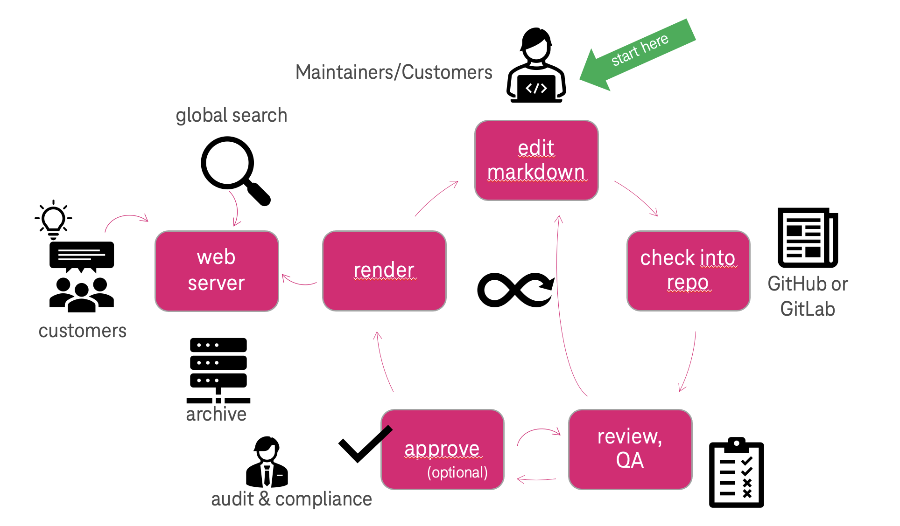

:orphan:

==============================
Documentation on Documentation
==============================

.. revealjs-slide::
   :theme: blood

:Revision: 2022-01-20

Why?
====

A modern approach to maintain documentation of the complex project is to
maintain it in a version control (git), build it whenever new changes are
merged and publish for convinient consumption.

Stakeholders
------------

Serves many stakeholders and purposes:

* Design: Engineering / Delivery (incl. delivery partners)
* Maintain and Verify: Operations and QA
* Review: Auditing and Certification
* **C U S T O M E R S**

Challenges
----------

* Accessibility: Where to find information?
* Accuracy: What are the latest version and change history?
* Update: Can several editors work in parallel?
* Reliable: Is the content reviewed?

Solution Options
----------------

.. revealjs-break::

**Word**: Send Word documents back and forth

.. container:: no-bullets

   * **+** everybody knows/has Word
   * **-** not everybody loves Word
   * **-** results are not consistent
   * **-** no proper versioning
   * **-** web publishing very difficult
   * **-** doc granularity blocks workflow
   * **-** slow

.. revealjs-break::

**Confluence**: Editing pages in Confluence

.. container:: no-bullets

   * **+** existing tools of the Jira/Confluence ecosystem
   * **+** plugins, basic versioning, and real-time collaboration
   * **-** only limited access to platform  for externals (like customers)
   * **-** external publishing is difficult
   * **-** content and rendering are tightly coupled

.. revealjs-break::

**GitOps**: Checking in RST in Git Repos

.. container:: no-bullets

   * **+** Git framework is battle tested in huge projects
   * **+** supports parallel documentation
   * **+** rendering and editing are decoupled
   * **+** Telekom CI can be applied
   * **+** integration in search and console possible
   * **+** optional customer feedback possible

How
===

Key Features
------------

* content over tools
* single source of truth
* gitops

Technical Details
-----------------

* Restructured Text (+ MarkDown support) as text format
* GitHub as a repository
* Zuul as CI/CD engine for workflows
* Sphinx as document rendering framework (HTML/PDF/Word)
* OTC infrastructure(ECS, object store, CSS + Kubernetes etc.)

Anatomy
-------

* Often, there is a bidirectional relationship between a squad and a service.
* Each service maps to one GitHub repository in the
  gh.io/opentelekomcloud-docs/ organization
* One repo may contain one or more documentation documents (e.g. user manual
  and API reference, or more)
* Each repo is technically a self-contained Python software project
* The documentation itself is located in .../doc/source, .../umn/source, or
  .../api-ref/source. The top-level file is index.rst.
* Documentation is formatted as ReStructured Text (\*.rst extension).

Local Build
-----------

It is not necessary to perform the steps described on this slide, but it can be
helpful/quicker to run the steps on a local server:

* Create a VM or container with a recent Linux image. Make sure Phython 3 and
  pip are installed (you may want to use a virtual env).
* Fork the original project from GitHub and clone it to your local server. Enter it.
* Edit documentation in …{doc,umn,api}/source. Initiate the build process with tox –e docs.
* Find the built artifacts in …/{doc,umn,api}/build/html.
* Open …/build/html/index.html in the browser to watch the results.

RACI Matrix
-----------

+-------------------------+--------+----------+----------+----+--------+
|                         | Author | Reviewer | Approver | RM | HC ops |
+-------------------------+--------+----------+----------+----+--------+
| Initialize Repo         |        |          | A        |    | R      |
+-------------------------+--------+----------+----------+----+--------+
| Initial Doc import      |        |          | A        |    | R      |
+-------------------------+--------+----------+----------+----+--------+
| Update content          | R      |          | A        |    | C      |
+-------------------------+--------+----------+----------+----+--------+
| Review proposed change  |        | R        | A        | A  | C      |
+-------------------------+--------+----------+----------+----+--------+
| Address review comments | R      |          | A        |    | C      |
+-------------------------+--------+----------+----------+----+--------+
| Approve changes         |        |          | A        | R  | C      |
+-------------------------+--------+----------+----------+----+--------+
| Platform Operations     |        |          |          |    | R      |
+-------------------------+--------+----------+----------+----+--------+

Restructured Text
=================

RST is a (relatively) simple text format to describe documentation. It can be
edited with any text editor.

RST is similar to the Markdown format but has much more features (e. g. macros).
Separate paragraphs by blank lines; section titles must be underlined with
"===" or "---" or etc.

Character formatting is possible for **\*\*bold\*\*** or *\*italics\**.

Linking is also `\`more sophisticated <url_link>\`_ <https://www.sphinx-doc.org/en/master/usage/restructuredtext/basics.html#hyperlinks>`_

More details `here
<https://www.sphinx-doc.org/en/master/usage/restructuredtext/basics.html>`_ and
`also here <htttps://docs.otc-service.com>`_.

Note that *all* RST files have to be accessible from the root node "index.rst" via linking!

Q&A
===
