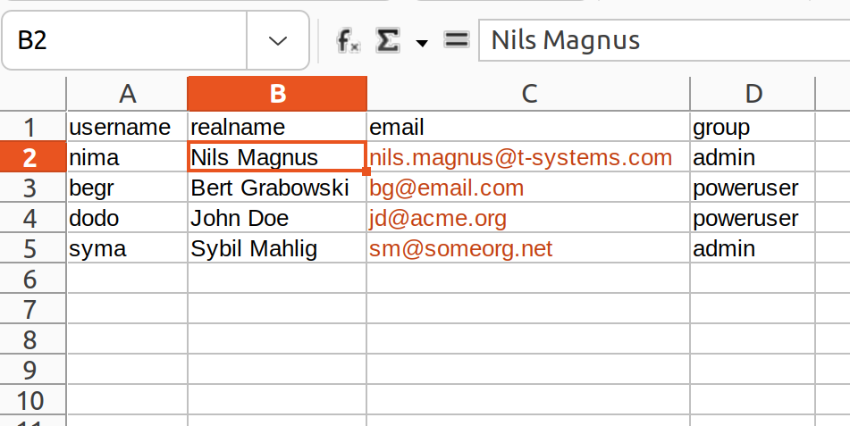

:orphan:

================================================
Creating Users in a Batch with the OpenStack SDK
================================================

.. revealjs-slide::

.. list-table::
   :widths: 70 30
   :header-rows: 0

   * - * **Nils Magnus**
       * Senior Cloud Architect Open Telekom Cloud
       * OpenInfra Meetup, Budapest, Hungary
       * live from Berlin, Germany
       * August 4, 2022

     - .. figure:: ./openinframeetup.png
	 

Nils Magnus
===========

.. list-table::
   :widths: 30 70
   :header-rows: 0

   * - .. figure:: ./nils-magnus.png

     - * Ecosystem Squad of Open Telekom Cloud
       * Tools for our users and Community work
       * 20 years experience in security, operations, cloud
       * tech writer, editor, and journalist
       * Director for German Unix User Group

	 
*Automation should make work easier, not take it away. --- Fred Ammon*

Prerequisites: Python
---------------------

Python 3 installed.

Any version up from Python 3.6 should do.

Verify:

.. code-block:: console

   $ python --version

Install:

.. code-block:: console

   $ apt install python3
   $ dnf install python3

Install OpenStack SDK
---------------------

recent version of the OpenStack SDK: 0.100.1

Verify:

.. code-block:: console

   $ pip show openstacksdk

Install:

.. code-block:: console

   $ pip install openstacksdk

Virtual environment or a user-based installation is recommended:

.. code-block:: console

   $ python3 - m venv demo
   $ ./demo/bin/activate
   (demo)
   

OTC Extensions
--------------

Optionally: Open Telekom Cloud specific functions

.. code-block:: console

   $ pip install otcextensions

pulls the SDK dependency automatically

not necessary for this very project, though.

Credentials
-----------

* commandline ``--os-password``: insecure

* environment variables ``export OS_PASSWORD``: somewhat insecure

* credentials stored in a file: recommended

Search path by descending precedence:

* ./cloud.yaml
* $HOME/.conf/openstack/clouds.yaml
* /etc/oenstack/clouds.yaml

Applies also to ``secure.yaml`` in the same directories.

Tokens
------

normal cloud resources require a regular token

user management requires a so-called **domain scoped token**

.. code-block:: yaml

  clouds:
    otc:
      profile: otc
      auth:
        username:           'johndoe'
        password:           'supersecret'
        project_name:       'eu-de'
        user_domain_name:   'OTC00000000001000000***'

    otcadmin:
      auth:
        username:           'johndoe'
        password:           'supersecret'
        auth_url:           'https://iam.eu-de.otc.t-systems.com:443/v3'
        user_domain_name:   'OTC00000000001000000***'
        domain_name:        'OTC00000000001000000***'
      interface:            'public'
      identity_api_version: 3

Quotas
------

Quota limit the number of users you can create

default for maximum users: 10

changed by a call or email to the Cloud Handling Support:

* domain ID (OTC00000000001000000*** or similar),
* the service (“Identity and Access Management”),
* the resource (user), and
* the new value of the quota.

The team is really quick, heads up to you guys!

Role Based Access Control
-------------------------

* tenant != domain ~ company, organization
* project ~ division, department

* policies: structure of capabilities
* groups: list of users a policy applies to

predefined groups in Open Telekom Cloud

* admin
* poweruser

Data to Create Users From
-------------------------

need four column heads in the CSV file:

columns can be in any order

Code Walkthrough
================

.. code-block:: python

  import openstack
  import csv

  co  = openstack.connect("otcadmin")
  idm = co.identity

  with open("workshop-users.csv", mode="r") as infile:
      for user in csv.DictReader(infile, delimiter=";"):
          print("User %s " % user["realname"], end="")
          userobj = idm.find_user(user["username"])
          if userobj:
              print("already exits.")
          else:
              userobj = idm.create_user(name=user["username"],
                                        email=user["email"],
                                        description=user["realname"])
              result = idm.post(
                  "https://iam.eu-de.otc.t-systems.com/v3.0/OS-USER/users/{user_id}/welcome"
                  .format(user_id=userobj.id))
              print(result.reason)
          print("Assigning user to group ", user["group"])
          groupobj = idm.find_group(user["group"])
                  
          co.add_user_to_group(userobj, groupobj)

Connecting to the Cloud
-----------------------
	
We first import openstack to be able to connect to the Open Telekom
Cloud and csv to read the spreadsheet data.

In the actual code, we connect to the cloud with the otcadmin instance
of the clouds.yaml file I mentioned above. The result is the
connection object co. It contains many services, but today, we just
need the IAM service, which I store in idm. Please keep in mind that
my config file provided me with a connection object based on a domain
scoped token, not a normal one.

Reading the Spreadsheets
------------------------

Next lines open the CSV file for reading and process its content line
by line, storing each row in the dictionary user. The idm service now
fetches the actual user object from the API and stores it in
userobj. If the cloud did not return an object, it has to be created,
passing the three attributes name, email, and description.

How to Set the Password
-----------------------

While the user resource now exists, the person behind it has to find
out about their credentials. Since dealing with clear-text passwords
is considered an antipattern, I send a welcome message to the
associated email address containing a brief welcome notification and a
link to log in. After that, the user can pick a password of her or his
own choice.

Dealing with Special API Calls
------------------------------

The API call for the welcome message is currently not directly covered
by the SDK, but the helper method `post()` of the IAM object can be
used to call the API directly. This should be done only as a last
resort since it circumvents several other useful mechanisms like
service catalog discovery and input validation. However, in this case,
we can get over it, I think. We just have to fill in the numeric user
ID in the REST call. We can verify if that worked by the value of
`result.reason`.

Assigning a Group
-----------------

Just creating users is not enough, though. It results in users with no
capabilities at all. That’s why I look up a group object from the IAM
and then associate it with the user object.

Wrap-Up
=======

* Installing Python, SDK (and OTC Extensions).
* Have credentials ready in `clouds.yaml`, Check quotas.
* Identify (or create) suitable groups.
* Arrange data in a spreadsheet.
  
* Import SDK and CSV handling. Connect to a cloud stanza that provides a domain scoped token.
* For each entry in the table:

  * create user if necessary,
  * invite user by email
  * assign proper group to user

Ressources
----------

IAM Documentation of the SDK:

https://docs.openstack.org/openstacksdk/latest/user/proxies/identity_v3.html

Blog artice in the Open telekom Cloud Community Portal:

https://community.open-telekom-cloud.com/communitysys_id=67d644cbb7985958d15aa7b16b8c02f0

Helpcenter:

https://docs.otc-service.com/

Open Telekom Cloud:

https://open-telekom-cloud.com/

Thanks for attending!
---------------------

Questions? Answers!

**Nils Magnus**

Senior Cloud Architect Open Telekom Cloud

nils.magnus@t-systems.com

